# FlowPilot AI — CRM & Support Orchestration System

FlowPilot AI is a state-of-the-art dashboard application that integrates **local, on-device Natural Language Processing (NLP)** with a dynamic **Customer Relationship Management (CRM) and support ticketing pipeline**. Built using FastAPI, SQLAlchemy, and React (Vite, TailwindCSS, Three.js, GSAP, and Framer Motion), the project showcases how advanced AI capabilities can run privately, securely, and completely on-device without cloud API dependencies.

---

## 📑 Table of Contents
1. [Key Features](#-key-features)
2. [System Architecture & Data Flow](#%EF%B8%8F-system-architecture--data-flow)
3. [Technology Stack](#-technology-stack)
4. [Project Directory Structure](#-project-directory-structure)
5. [Database Schema Details](#-database-schema-details)
6. [Getting Started & Installation](#-getting-started--installation)
7. [On-Device NLP Engine Deep Dive (For Seminar)](#-on-device-nlp-engine-deep-dive-for-seminar)
8. [Premium UI/UX Features](#-premium-uiux-features)
9. [Seminar Presentation Guide (Slide-by-Slide)](#-seminar-presentation-guide-slide-by-slide)

---

## ✨ Key Features

- **On-Device Zero-Shot NLP Engine**: Uses HuggingFace's `facebook/bart-large-mnli` model to perform zero-shot intent classification directly on the CPU (no CUDA/GPU required).
- **Intelligent Fallback Layer**: If the model is loading or machine learning libraries are missing, a robust regular-expression (regex) classification engine acts as a fallback to guarantee 100% application uptime.
- **Dynamic CRM Orchestration**: Automatically extracts business metrics (budget, service type, and priority level) from free-form chat messages and inserts new Leads and Customers into the SQLite database.
- **Automatic Support Ticketing**: Detects technical complaints, server crashes, or billing issues, classifies them as "Support Requests," determines priority, and generates an operational support ticket in real-time.
- **Stunning, Interactive UI/UX**:
  - WebGL 3D scene rendering an interactive data node mesh using **Three.js** (`@react-three/fiber`).
  - Spring-based **magnetic button physics** powered by **GSAP**.
  - Custom dynamic cursor that reacts to interactive elements.
  - Page transitions and smooth micro-animations using **Framer Motion**.
  - Dynamic telemetry visuals and metrics using **Recharts**.

---

## ⚙️ System Architecture & Data Flow

Below is the step-by-step pipeline of how FlowPilot AI orchestrates incoming data:

```mermaid
sequenceDiagram
    autonumber
    actor User as Client / Operator
    participant FE as React Frontend (Vite)
    participant BE as FastAPI Backend
    participant NLP as Local NLP Engine (BART)
    participant DB as SQLite DB (SQLAlchemy)

    User->>FE: Types message: "Need a mobile app, budget is 40k. Urgent!"
    FE->>BE: POST /api/ai/chat { message }
    Note over BE,NLP: Server processes message
    BE->>NLP: Classifies intent & extracts entities
    NLP-->>BE: Intent: "Sales Inquiry", Service: "Mobile Application", Budget: 40000.0, Priority: "High"
    
    rect rgb(30, 41, 59)
        Note over BE,DB: Database Sync
        BE->>DB: INSERT into "leads" (Mobile Application, Budget: 40k, Priority: High)
        BE->>DB: INSERT into "customers" (Prospect status, Revenue: 40k)
        BE->>DB: INSERT into "conversations" (Chat history & entities logs)
    end
    
    DB-->>BE: Database commit success
    BE-->>FE: Return AI reply, classified intent & metadata
    FE->>User: Displays animated response & Toast Notification of database sync
```



---

## 🛠️ Technology Stack

### Backend
- **Core Framework**: [FastAPI](https://fastapi.tiangolo.com/) (Python ASGI microframework for high-performance async APIs)
- **Database ORM**: [SQLAlchemy](https://www.sqlalchemy.org/) with [SQLite](https://www.sqlite.org/) (Local file database: `flowpilot.db`)
- **Natural Language Processing**: HuggingFace [Transformers](https://github.com/huggingface/transformers) with [PyTorch](https://pytorch.org/) (CPU execution)
- **Security / Auth**: JSON Web Tokens (JWT) using `python-jose` and `passlib[bcrypt]` for secure password hashing

### Frontend
- **Framework**: [React](https://react.dev/) initialized with [Vite](https://vite.dev/) (Fast ES-module bundler)
- **Styling**: [TailwindCSS v4](https://tailwindcss.com/) (Utility-first styling Engine)
- **3D Graphics**: [Three.js](https://threejs.org/) via `@react-three/fiber` & `@react-three/drei`
- **Animations**: [GSAP](https://gsap.com/) (GreenSock Animation Platform) & [Framer Motion](https://www.framer.com/motion/)
- **Charts / Telemetry**: [Recharts](https://recharts.org/) (Composable SVG charts)
- **Icons**: [Lucide React](https://lucide.dev/)

---

## 📁 Project Directory Structure

```
flowPioletAi/
├── .gitignore                   # Root level git ignore settings (ignores pycache, node_modules, db files)
├── README.md                    # Core project documentation (this file)
├── backend/
│   ├── requirements.txt         # Python library dependencies (fastapi, torch, transformers, etc.)
│   ├── verify_backend.py        # Helper script to test backend startup and NLP model load
│   └── app/
│       ├── __init__.py
│       ├── ai.py                # Zero-shot model classifier, regex parsing, and entity extractor
│       ├── auth.py              # JWT token generator, security schemas, password hashes
│       ├── database.py          # SQLAlchemy connection engine & DB session setup
│       ├── main.py              # FastAPI app routing, pre-seeding logic, and business endpoints
│       ├── models.py            # SQLAlchemy Declarative Models (User, Lead, Customer, Ticket, Conversation)
│       └── schemas.py           # Pydantic models for request/response serialization
└── frontend/
    ├── package.json             # Node dependencies and scripts
    ├── index.html               # Main HTML injection shell
    ├── tailwind.config.js       # TailwindCSS utility configurations
    ├── vite.config.js           # Vite bundle settings
    └── src/
        ├── App.jsx              # Main React App routing, context providers, and page animation containers
        ├── main.jsx             # React entry point
        ├── index.css            # Custom typography & global styling overrides
        ├── assets/              # App images (hero.png, logos)
        ├── components/          # Reusable design components
        │   ├── Animations.jsx   # Page wrapper with framer-motion entry/exit animations
        │   ├── CustomCursor.jsx # Reactive cursor tracking hover and click states
        │   ├── DashboardLayout.jsx # Premium dashboard sidebar wrapper with sidebar navigation
        │   ├── MagneticButton.jsx # GSAP-based magnetic spring animation for buttons
        │   ├── ThemeToggle.jsx  # Dark/Light theme switcher
        │   ├── ThreeScene.jsx   # React Three Fiber canvas drawing 3D active grid systems
        │   └── Toast.jsx        # Custom context-based toast alert notifications
        ├── context/
        │   └── ThemeContext.jsx # Global dark mode context manager
        └── pages/               # Functional pages
            ├── LandingPage.jsx  # Landing page showing product features & call to action
            ├── AuthPages.jsx    # Unified Login and Register forms
            ├── DashboardPage.jsx # CRM Metrics Overview, telemetry graphs, and logs
            ├── AIAgentPage.jsx  # Live AI Chatbot with entity extractor logs
            ├── LeadsPage.jsx    # Table of current sales leads, budget, status, and AI score
            ├── CustomersPage.jsx # Table of current clients and total revenue tracking
            ├── SupportPage.jsx  # Operations tickets status board (Open / In Progress / Resolved)
            ├── AnalyticsPage.jsx # In-depth sales charts and AI-categorized intents analysis
            └── SettingsPage.jsx # Settings (NLP toggle details, mock variables config)
```

---

## 🗄️ Database Schema Details

All database transactions are structured inside `backend/app/models.py`. Here are the primary entities and relationships:

```
                  +-----------------------+
                  |         users         |
                  +-----------------------+
                  | id (PK)               |
                  | username              |
                  | email                 |
                  | hashed_password       |
                  | created_at            |
                  +-----------+-----------+
                              |
       +----------------------+--------------------+---------------------+
       | 1:N                  | 1:N                | 1:N                 | 1:N
+------v-------+      +-------v------+      +------v-------+      +------v------------+
|    leads     |      |  customers   |      |   tickets    |      |   conversations   |
+--------------+      +--------------+      +--------------+      +-------------------+
| id (PK)      |      | id (PK)      |      | id (PK/String|      | id (PK)           |
| name         |      | name         |      | customer_name|      | messages (JSON)   |
| service      |      | email        |      | issue        |      | extracted_info    |
| budget (Float|      | phone        |      | priority     |      | status            |
| priority     |      | status       |      | status       |      | created_at        |
| score (Int)  |      | revenue      |      | category     |      | user_id (FK)      |
| status       |      | joined_at    |      | created_at   |      +-------------------+
| source       |      | user_id (FK) |      | user_id (FK) |
| created_at   |      +--------------+      +--------------+
| user_id (FK) |
+--------------+
```

- **Relationships**:
  - `User` has one-to-many (`1:N`) relationships with `Lead`, `Customer`, `Ticket`, and `Conversation`.
  - When an AI message triggers an action, it automatically references the logged-in user (falling back to a seeded system operator user).

---

## 🚀 Getting Started & Installation

### Prerequisites
- Python 3.8 or higher installed on your system.
- Node.js (v18 or higher) & npm.

---

### Step 1: Set Up Backend

1. Navigate to the `backend` folder:
   ```bash
   cd backend
   ```

2. Create a virtual environment and activate it:
   ```bash
   # Windows (PowerShell)
   python -m venv venv
   .\venv\Scripts\Activate.ps1

   # Linux/macOS
   python3 -m venv venv
   source venv/bin/activate
   ```

3. Install the dependencies:
   ```bash
   pip install -r requirements.txt
   ```
   *Note: Downloading `torch` and `transformers` might take a few minutes depending on your internet connection.*

4. Verify your NLP setup and pre-load the model cache:
   ```bash
   python verify_backend.py
   ```
   *This downloads the model weights for `facebook/bart-large-mnli` (approx. 1.63 GB) locally so that the server starts instantly during presentation.*

5. Start the FastAPI development server:
   ```bash
   uvicorn app.main:app --reload --port 8000
   ```
   The backend documentation will be accessible at: `http://127.0.0.1:8000/docs` (Swagger UI)

---

### Step 2: Set Up Frontend

1. Open a new terminal window and navigate to the `frontend` folder:
   ```bash
   cd frontend
   ```

2. Install Node dependencies:
   ```bash
   npm install
   ```

3. Start the Vite React development server:
   ```bash
   npm run dev
   ```

4. Open the application in your browser:
   `http://localhost:5173`

---

## 🤖 On-Device NLP Engine Deep Dive (For Seminar)

During your presentation, you can explain how FlowPilot's AI classification layer operates:

### 1. What is Zero-Shot Classification?
Unlike traditional supervised sentiment analysis (which requires a custom-trained model for every single set of categories), zero-shot classification uses a model pre-trained on Natural Language Inference (NLI). 
In NLI, we provide a premise (the client's message) and formulate hypotheses like *"This text is about Sales Inquiry"* or *"This text is about a technical issue"*. The model predicts the probability that the premise entails the hypothesis.

### 2. Implementation in Code (`backend/app/ai.py`)
```python
# We use HuggingFace zero-shot-classification pipeline with facebook/bart-large-mnli
classifier = pipeline(
    "zero-shot-classification",
    model="facebook/bart-large-mnli",
    device=-1  # CPU mode ensures compatibility without dedicated GPU drivers
)

# Candidates that the system classifies into:
candidate_labels = ["Sales Inquiry", "Support Request", "Customer Success", "General Question"]

# The pipeline returns the probability scores for each label
result = classifier(message, candidate_labels=candidate_labels)
intent = result["labels"][0] # highest confidence
```

### 3. Entity Extraction & Fallback Engine
To speed up calculations and ensure fallback resilience, the engine uses structured Regex:
- **Budget Matching**: Regex searches for numerical values trailing cost indicators (e.g. `budget: $10k`, `worth 50000`, `spend 5000`). It automatically parses shorthand formatting like `k` or `K` (e.g. `50k` -> `50000`).
- **Service Keywords**: Parses the text to identify category strings like `ecommerce`, `api`, `mobile app`, `cybersecurity`.
- **Match Priority & Score**: Computes priority levels and leads scores natively based on budget amount and key phrases (e.g., budget > $50k gets prioritized as "High" with a 97% match score).

---

## 🎨 Premium UI/UX Features

- **Magnetic Buttons (`frontend/src/components/MagneticButton.jsx`)**: Uses **GSAP** to create an interactive cursor-magnetism effect. When the cursor moves near a primary button, the button moves slightly towards the cursor using elastic spring transitions, mimicking physical gravity.
- **WebGL Interactive Node Grid (`frontend/src/components/ThreeScene.jsx`)**: Utilizing `@react-three/fiber`, it embeds a floating, rotating grid of geometric stars that rotate on user scroll or mouse hover, representing the complex AI nodes running under the dashboard.
- **State-of-the-Art Theme Management (`frontend/src/context/ThemeContext.jsx`)**: Complete dark and light mode system that toggles custom theme tokens. Transition states are animated with custom CSS to prevent stark flashes of light/dark.

---

## 🎤 Seminar Presentation Guide (Slide-by-Slide)

Here is a template structure you can use to deliver an outstanding seminar presentation on FlowPilot AI:

### Slide 1: Title & Introduction
- **Slide Title**: FlowPilot AI: Reimagining CRMs with Local, On-Device AI Pipelines.
- **Key Points to Say**:
  - Introduce yourself and the project name.
  - Explain the core thesis: Traditional CRM dashboards rely heavily on cloud APIs (like OpenAI or Anthropic) which pose issues with user privacy, high operational latency, and usage costs. FlowPilot runs its NLP entirely locally.

### Slide 2: The Core Engineering Challenges
- **Slide Title**: The Architecture Dilemma: Cloud vs. Edge
- **Key Points to Say**:
  - High costs of external API subscriptions.
  - Leakage of sensitive business conversations or client details to public cloud LLM servers.
  - Requirement for offline-first capabilities or resilience during internet outages.

### Slide 3: The FlowPilot Solution
- **Slide Title**: Hybrid Intelligence Engine
- **Key Points to Say**:
  - Show the Sequence Diagram (included in this README).
  - Walk through how an incoming chat string travels from the React front-end, through the FastAPI endpoints, gets evaluated by a local BART zero-shot model, and updates SQLite dynamically.

### Slide 4: Deep-Dive: NLP at the Edge
- **Slide Title**: Edge Computing with BART Zero-Shot Classification
- **Key Points to Say**:
  - Discuss `facebook/bart-large-mnli`.
  - Explain how Natural Language Inference (NLI) enables classifying messages into *Sales*, *Support*, or *General Inquiry* without fine-tuning model weights.
  - Discuss the Regex Fallback layer: why safety nets are critical in production software.

### Slide 5: Dynamic CRM Orchestration
- **Slide Title**: Automating the Sales & Support Funnel
- **Key Points to Say**:
  - Detail how entity extraction identifies budgets, service categories, and priority metrics.
  - Mention database auto-syncing: how a message about database failure automatically triggers a support ticket with High priority without administrator manual input.

### Slide 6: Visual & Interface Excellence
- **Slide Title**: Crafting a Premium User Experience
- **Key Points to Say**:
  - Highlight the tech stack used in UI development: GSAP for custom cursor tracking and spring physics (magnetic buttons).
  - WebGL three-dimensional nodes rendering the abstract neural network grid.
  - Interactive charts displaying lead analysis.

### Slide 7: Live Demonstration
- **Slide Title**: Live System Demonstration
- **Key Points to Say**:
  - Run the backend and frontend locally.
  - Show the landing page, register a new account, and open the Dashboard.
  - Go to the **AI Agent** tab. Type: `"I need a custom CRM integration, we have around 45k to spend"`
  - Go to the **Leads** and **Customers** tab to show that the details have been logged instantly.
  - Open the chat again, type: `"The production database is down, website crashed!"`
  - Show the **Support Board** to display the newly created ticket `FP-XXXX` under "High" priority.

### Slide 8: Future Directions & Q&A
- **Slide Title**: Future Implementations & Questions
- **Key Points to Say**:
  - Summarize achievements: Offline capable, private data, zero API cost.
  - Future scope: Quantization of larger models (e.g., Llama-3 or Mistral-7B) to run on local laptops, web assembly models running directly in browsers.
  - Open the floor for questions from the committee/audience.
